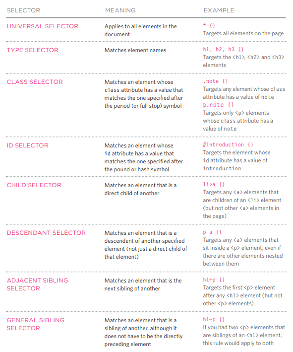

# css:
**CSS:** let you present your web site with deffirent styles, by treating each HTML element as it is inside a box and you wantt to apply rules on it to indicate its style, and rules in CSS compresses from: 
``` Selector {Indicator} ``` which is writen like ``` slector { property : Value ; } ``` 
 * selectors specify the elements the rule applies to.
 * declarations: that indicate what these elements should look like. which includes the the properties of the element that you want to change, and the values of those properties.


**Example**
``` body {font-family: arial; background-color: rgb(185,179,175);} ```
```h1 {color: rgb(255,255,255);} ```


**Note: CSS rules usually appear in a separate document, although they may appear within an HTML page.**

## IMPORTANT syntaxes: 
- uses the <link> element to indicate where the CSS file is located. ``` <link href="css/styles.css" type="text/css"rel="stylesheet" /> ```
-  include CSS rules within an HTML page```<style type="text/css"> body {font-family: arial;</style>``` 
- add identity in HTML and ```  <h1 id="top">Kitchen Garden Calendar</h1>```
- CSS selector:





- /* change color by name */ ``` h1 {color: DarkCyan;}```
- /* change hex by code */ ```h2 {color: #ee3e80;}```
- /* change rgb by value */ ```p {color: rgb(100,100,90);}```


## Notes on Color in CSS:
1. Color not only brings your site to life, but also helps convey the mood and evokes reactions.
2. There are three ways to specify colors in CSS: RGB values, hex codes, and color names.
3. Color pickers can help you find the color you want.
4. It is important to ensure that there is enough contrast between any text and the background color (otherwise people will not be able to read your content).
5. CSS3 has introduced an extra value for RGB colors to indicate opacity. It is known as RGBA.
6. CSS3 also allows you to specify colors as HSL values, with an optional opacity value. It is known as HSLA.


