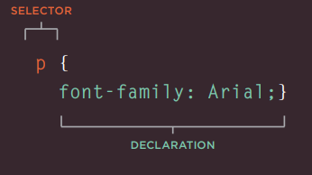

# css:
**CSS:** let you present your web site with deffirent styles, by treating each HTML element as it is inside a box and you wantt to apply rules on it to indicate its style, and rules in CSS compresses from: 
``` Selector {Indicator} ``` which is writen like ``` slector { property : Value ; } ``` 
 * selectors specify the elements the rule applies to.
 * declarations: that indicate what these elements should look like. which includes the the properties of the element that you want to change, and the values of those properties.





**Example**
``` body {font-family: arial; background-color: rgb(185,179,175);} ```
```h1 {color: rgb(255,255,255);} ```


**Note: CSS rules usually appear in a separate document, although they may appear within an HTML page.**

## IMPORTANT syntaxes: 
- uses the <link> element to indicate where the CSS file is located. ``` <link href="css/styles.css" type="text/css"rel="stylesheet" /> ```
-  include CSS rules within an HTML page```<style type="text/css"> body {font-family: arial;</style>``` 
- ```<body>
 <h1 id="top">Kitchen Garden Calendar</h1>
 <p id="introduction">Here you can read our
 handy guide about what to do when.</p> 
 ```
 ```<body>
 <h1 id="top">Kitchen Garden Calendar</h1>
 <p id="introduction">Here you can read our
 handy guide about what to do when.</p> 
 ```