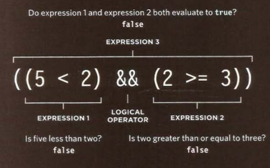

# Comparison and Logical Operators

**Comparison Operations are:**

== | != | === | !== | < | > | <= | >= 
---|----|-----|-----|---|---|----|----
equal to | not equal to | strict equal | strict not equal | less than | greater than | Less than or equal | greater than or equal

**Logical Operators are:**
it allow you to compare  the results of more than one comparison operator.

&& | || | ! 
===|====|===
logical AND | logical OR | logical NOT
